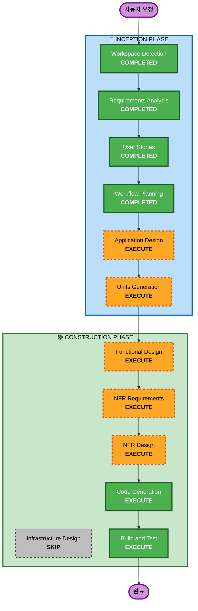

# Execution Plan

## 상세 분석 요약

### 변경 영향 평가
- **사용자 대면 변경**: Yes - 고객용 주문 UI, 관리자용 관리 UI 전체 신규 구축
- **구조적 변경**: Yes - 프론트엔드(React), 백엔드(Go), 데이터베이스(MySQL) 전체 아키텍처 신규
- **데이터 모델 변경**: Yes - Store, Table, TableSession, Menu, Order, OrderItem, OrderHistory 7개 엔티티
- **API 변경**: Yes - 고객용 4개, 관리자용 10개 총 14개 API 엔드포인트
- **NFR 영향**: Yes - API 100ms 이하, 500명 동시 접속, SSE 실시간 통신, JWT 보안

### 위험 평가
- **위험 수준**: Medium
- **롤백 복잡도**: Easy (신규 프로젝트)
- **테스트 복잡도**: Complex (Unit + Integration + E2E)

---

## Workflow Visualization



### 텍스트 대안
```
INCEPTION PHASE:
  1. Workspace Detection    (COMPLETED)
  2. Requirements Analysis  (COMPLETED)
  3. User Stories           (COMPLETED)
  4. Workflow Planning      (COMPLETED)
  5. Application Design    (EXECUTE)
  6. Units Generation      (EXECUTE)

CONSTRUCTION PHASE:
  7. Functional Design      (EXECUTE, per-unit)
  8. NFR Requirements       (EXECUTE, per-unit)
  9. NFR Design             (EXECUTE, per-unit)
  10. Infrastructure Design (SKIP)
  11. Code Generation       (EXECUTE, per-unit)
  12. Build and Test        (EXECUTE)
```

---

## 실행할 단계

### 🔵 INCEPTION PHASE
- [x] Workspace Detection (COMPLETED)
- [x] Reverse Engineering (SKIPPED - Greenfield)
- [x] Requirements Analysis (COMPLETED)
- [x] User Stories (COMPLETED)
- [x] Workflow Planning (COMPLETED)
- [ ] Application Design - **EXECUTE**
  - **근거**: 신규 프로젝트로 컴포넌트 식별, 서비스 레이어 설계, 컴포넌트 간 의존성 정의 필요
- [ ] Units Generation - **EXECUTE**
  - **근거**: 복잡한 시스템으로 프론트엔드/백엔드를 독립적인 작업 단위로 분해 필요

### 🟢 CONSTRUCTION PHASE (per-unit)
- [ ] Functional Design - **EXECUTE**
  - **근거**: 7개 데이터 모델, 복잡한 비즈니스 로직 (주문 생성, 세션 관리, 상태 변경) 상세 설계 필요
- [ ] NFR Requirements - **EXECUTE**
  - **근거**: API 100ms 이하 성능, 500명 동시 접속, SSE 실시간 통신, JWT 보안 등 NFR 요구사항 존재
- [ ] NFR Design - **EXECUTE**
  - **근거**: NFR Requirements 실행 시 NFR 패턴 설계 필요
- [ ] Infrastructure Design - **SKIP**
  - **근거**: 로컬 서버(On-premises) 배포로 클라우드 인프라 매핑 불필요
- [ ] Code Generation - **EXECUTE** (항상)
  - **근거**: 코드 구현 필요
- [ ] Build and Test - **EXECUTE** (항상)
  - **근거**: 빌드, 테스트, 검증 필요

### 🟡 OPERATIONS PHASE
- [ ] Operations - PLACEHOLDER
  - **근거**: 향후 배포 및 모니터링 워크플로우

---

## 예상 일정
- **총 실행 단계**: 10개 (완료 4 + 실행 예정 6)
- **건너뛸 단계**: 3개 (Reverse Engineering, Infrastructure Design, Operations)

## 성공 기준
- **주요 목표**: 테이블오더 서비스 MVP 완성
- **핵심 산출물**:
  - React + TypeScript + HeroUI v3 프론트엔드 (고객용, 관리자용)
  - Go + Gin 백엔드 API 서버
  - MySQL 데이터베이스 스키마
  - SSE 기반 실시간 주문 모니터링
  - JWT Access/Refresh Token 인증 시스템
  - Unit + Integration + E2E 테스트
- **품질 게이트**:
  - API 응답 시간 100ms 이하
  - 500명 이상 동시 접속 지원
  - 한국어 + 영어 다국어 지원

---

**문서 버전**: 1.0  
**작성일**: 2026-02-25  
**상태**: 승인 대기
